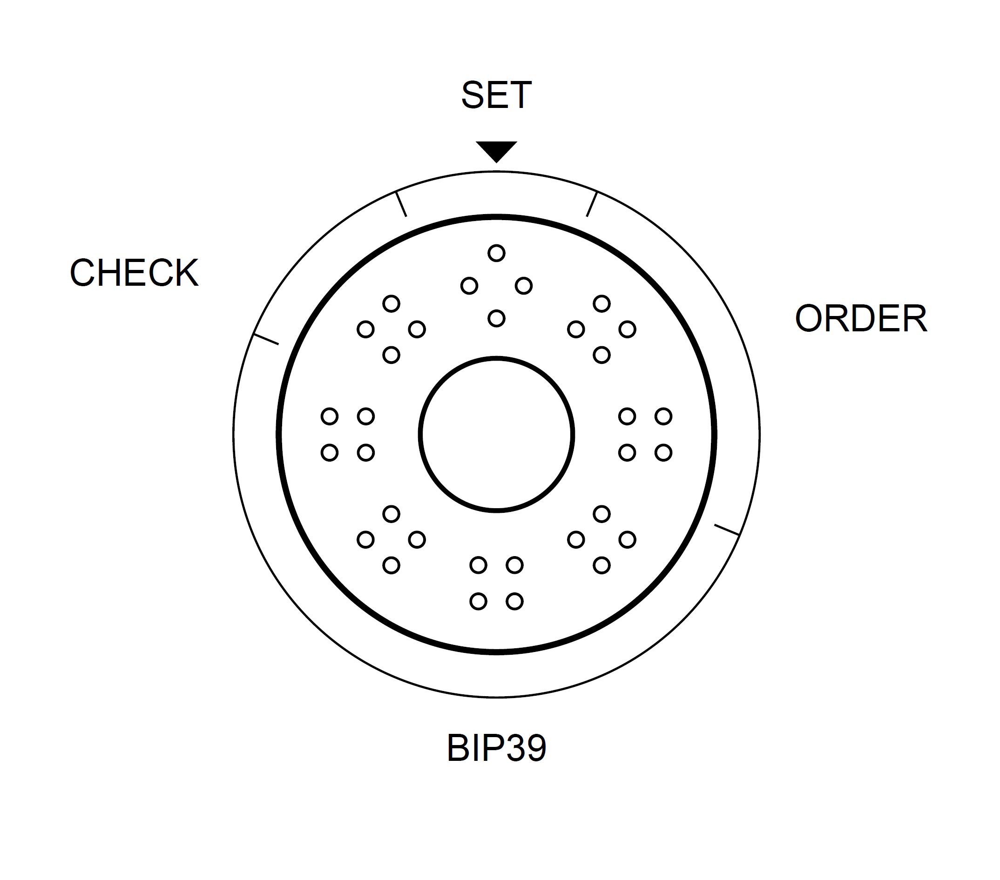
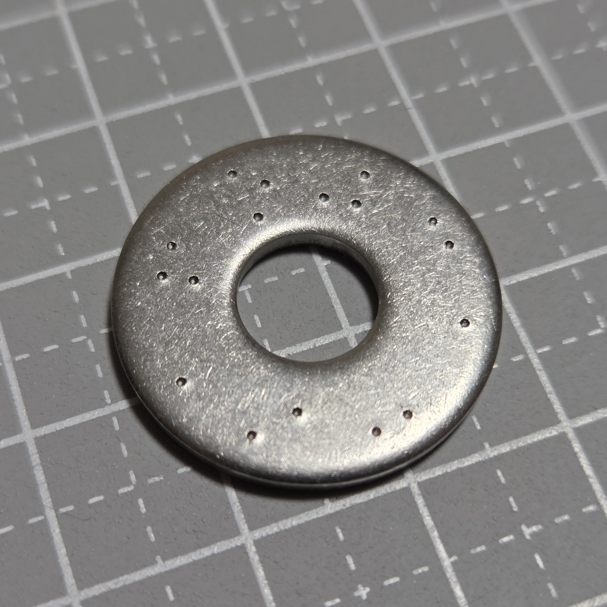
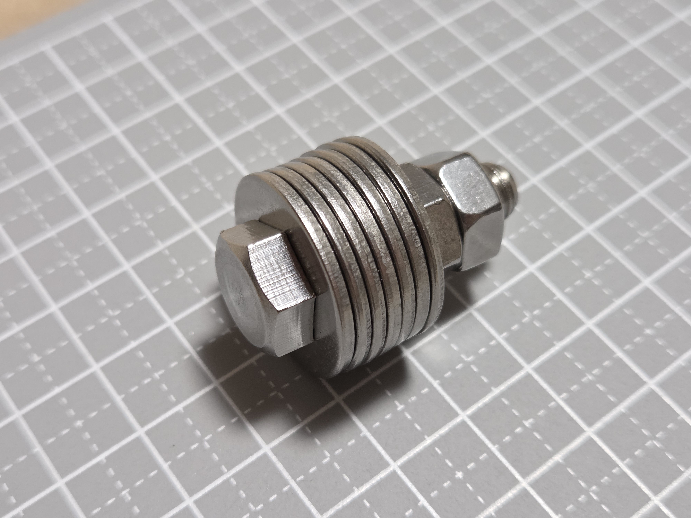

# Washer Punch39

**BIP39 Center-Punch Washer Backup**

ステンレスワッシャーとセンターポンチを使って、[BIP39](https://github.com/bitcoin/bips/blob/master/bip-0039.mediawiki) Englishニーモニックを金属へ記録するDIYバックアップ方式です。

**フォーマットバージョン: v1**

<p align="center">
  
  
  
</p>

1面に1単語を、BIP39単語番号の10進4桁と4点式の点字数字で記録します。実寸の紙治具をワッシャーへ重ね、その上からセンターポンチで直接打刻します。

> **状態:** 実験中 / 開発中です。仕様・印刷寸法・打刻方法・復元手順を独立に検証するまでは、実資金の唯一のバックアップとして使用しないでください。

## 特徴

- 安価で入手しやすいステンレスワッシャーを使う
- 専用ソフトウェアなしでも印刷資料から復元できる
- ワッシャーがバラバラになっても語順を復元できる
- 紙と鉛筆で確認できる単純な誤り検出を持つ
- 紙治具にはシード固有の秘密情報を印刷しない

## 他方式と比べた強み

Washer Punch39 は、最小サイズや最少打刻数よりも、**汎用品で作れること、失敗からやり直しやすいこと、人間が読んで検証しやすいこと、分離しても復元できること**を重視しています。

- **専用金属プレートが不要** — 一般流通のステンレスワッシャー、ボルト、ナット、センターポンチと印刷した紙治具で作れます。専用品の継続販売に依存しません。
- **打刻ミスの影響を局所化できる** — 1単語を打ち間違えた場合、そのワッシャーだけを交換して作り直せます。一枚板方式のように、ミスの位置によって全体を作り直す必要がある構成を避けられます。
- **バラバラになっても復元できる** — 各面に SET、語順、BIP39番号、CHECK を持たせるため、ワッシャーの物理的な並び順だけに依存しません。
- **10進数のまま人間が扱える** — BIP39番号を `0001`〜`2048` の10進4桁で記録します。二進数への変換を必要とせず、印刷資料と紙・鉛筆だけで読解・確認できます。
- **1語ごとにその場で検算できる** — 各面のBIP39番号には単純mod 10のCHECKがあり、ニーモニック全体を復元する前でも、その面の読み取りが怪しくないか確認できます。
- **廃棄時に元パターンを壊しやすい** — 候補点の有無が情報なので、候補点付近へランダムに追加打刻することで元のパターンを判別しにくくできます。廃棄時には紙治具や正確な位置合わせも不要です。
- **追加カバーなしで外面を無打刻にできる** — 12単語・7枚のリファレンス構成では、最初と最後のワッシャーを片面打刻にして無打刻面を外側へ向けます。

その代わり、一枚板方式や高密度な二進符号化と比べると、部品数や打刻数は多くなる場合があります。Washer Punch39 はコンパクトさよりも、**入手性・修理性・人間による検証のしやすさ**を優先する設計です。

## 仕組み

その面を正面に向け、**開始兼SETから時計回り**に読みます。

```text
開始兼SET | 語順2桁 | BIP39番号4桁 | CHECK
```

- **SET** — 複数のニーモニックを保存するときの識別子。標準では A=右、B=左
- **語順** — 現在の12単語リファレンスでは `01`〜`12`
- **BIP39番号** — BIP39 Englishワードリストを1始まりの `0001`〜`2048` で記録
- **CHECK** — BIP39番号4桁だけを対象とする単純mod 10

数字0〜9は標準点字数字の上4点を使います。数字専用領域なので数符は記録しません。

| 0 | 1 | 2 | 3 | 4 | 5 | 6 | 7 | 8 | 9 |
| :-: | :-: | :-: | :-: | :-: | :-: | :-: | :-: | :-: | :-: |
| ⠚ | ⠁ | ⠃ | ⠉ | ⠙ | ⠑ | ⠋ | ⠛ | ⠓ | ⠊ |

正確なブロック角度、候補点座標、点字セル寸法などは[詳細仕様](docs/specification_ja.md)を参照してください。

## 現在のリファレンス構成

このリポジトリで配布する実寸資料は、次を基準にしています。

- DIN 9021相当 M8平ワッシャー
- SUS304 / A2ステンレス
- 外径 **24.0 mm** / 内径 **8.4 mm** / 厚さ **2.0 mm**
- 打刻された1面 = 1単語
- **12単語 = 7枚**

7枚構成では、1枚目と7枚目の無刻印面を外側へ向け、組み上げた状態で打刻が直接見えにくいようにします。ワッシャーはボルトへ通し、**ダブルナット**で固定します。

この7枚構成やワッシャー寸法は現在のリファレンス実装であり、符号化方式そのものの必須条件ではありません。

## 以前の電解エッチング方式からの改善

Washer Punch39 は、作者が2022年に公開したワッシャー式DIYメタルウォレットを発展させたものです。以前の方式については、以下の記事を参照してください（いずれも日本語です）。

- [激安！DIYメタルウォレット【電解エッチング】](https://spotlight.soy/detail?article_id=9hbcxftqd)
- [検証！DIYメタルウォレット【火あぶりの刑】](https://spotlight.soy/detail?article_id=ojr7i5w1k)

主な改善点：

- **製作時間を短縮** — 電解エッチングはマスキング、手書き、乾燥、エッチング、洗浄に時間がかかり、24単語の実作例では約4時間かかりました。Washer Punch39では紙治具越しのセンターポンチ打刻に変更しています。
- **細かい手作業を減らした** — 文字を手で書いてマスキングを削る作業には手先の器用さが必要でした。現在は決められた候補点を打刻する方式です。
- **道具と後処理を簡略化** — 電池、ワニ口クリップ、エッチング液、マニキュア、除光液などを使う工程をなくしました。
- **記録形式を明確化** — 英単語を直接書く代わりに、BIP39番号を点字数字で記録し、SET・語順・CHECKを含む固定形式にしました。
- **廃棄しやすい** — 電解エッチングされた文字は、廃棄時に確実に読めなくする処理が面倒でした。Washer Punch39では候補点の有無が情報なので、候補点付近へランダムに追加打刻して元のパターンを壊せます。紙治具や正確な位置合わせも不要です。
- **緩み止めを変更** — 以前はスプリングワッシャーを使っていましたが、加熱試験後にはばね性がほぼ失われました。現在はダブルナットで固定します。
- **12単語を8枚から7枚へ** — 以前は6枚のデータ用ワッシャーの前後に無打刻ワッシャーを追加して8枚としていました。現在は最初と最後のワッシャーを片面打刻にし、その無打刻面を外側へ向けることで7枚にしています。

## 打刻の流れ

1. [紙治具PDF](pdf/bip39-washer-punching-jig-m8-a4.pdf)を **100% / 実際のサイズ / 拡大縮小なし** で印刷する
2. 50 mm確認線を測って印刷倍率を確認する
3. 紙治具とワッシャーを位置合わせして固定する
4. 必要な候補点だけを紙治具越しに直接打刻し、治具を外して確認する
5. 必要に応じて裏面も同様に打刻する

復元方法は[復元手順](docs/recovery_ja.md)を参照してください。

## PDF資料

- [クイックリファレンス（日本語）](pdf/bip39-washer-quick-reference-a4.pdf)
- [紙治具（日本語）](pdf/bip39-washer-punching-jig-m8-a4.pdf)
- [BIP39 English ワードリスト（1始まり）](pdf/bip39-english-wordlist-1based-a4.pdf)

## ドキュメント

- [詳細仕様](docs/specification_ja.md)
- [復元手順](docs/recovery_ja.md)
- [設計理由](docs/design-rationale_ja.md)
- [実物例](docs/physical-example_ja.md)
- [加熱・急冷試験（補足資料）](docs/fire-test_ja.md)
- [English README](README.md)

## 注意点

- これは物理バックアップ方式であり暗号化ではありません。必要なワッシャーを読める人はニーモニックを復元できます。
- **Washer Punch39 v1 が保存するのはBIP39ニーモニックだけです。** BIP39パスフレーズを使用する場合は別途バックアップしてください。
- mod 10のCHECKは誤り訂正ではなく、すべての複数誤りを検出できるわけではありません。
- SETと語順は各面のCHECK対象外です。
- 実際のバックアップを作る前に、PDFの実寸と打刻・復元手順を必ず確認してください。
- 別のワッシャー寸法、語数、配置、工具へ応用する場合は、対応する幾何配置と復元規則を再設計して検証してください。

## ライセンス

このプロジェクトは [MIT License](LICENSE) で公開しています。
