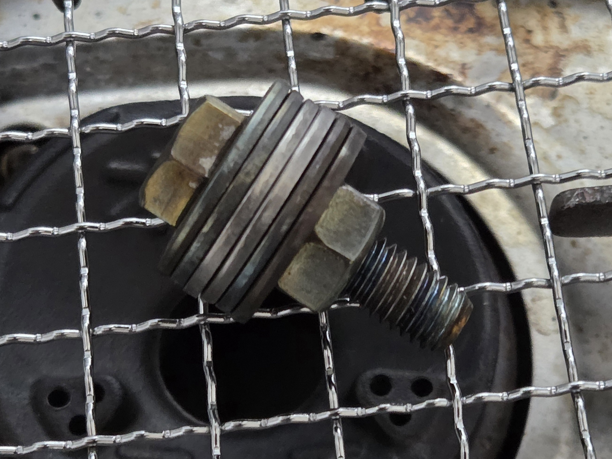
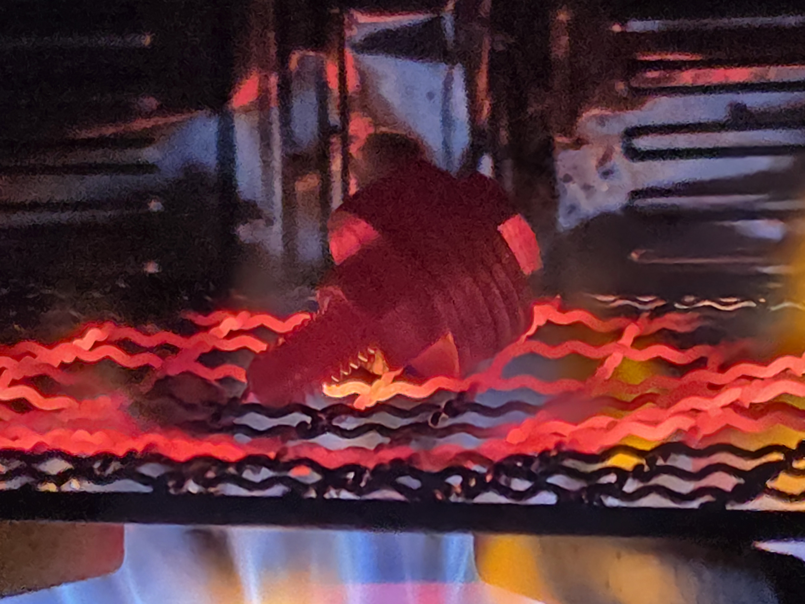
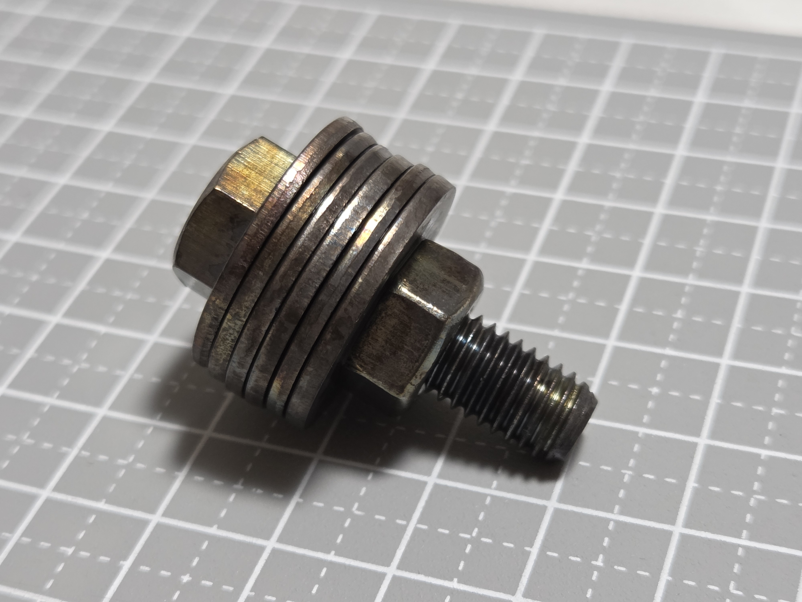
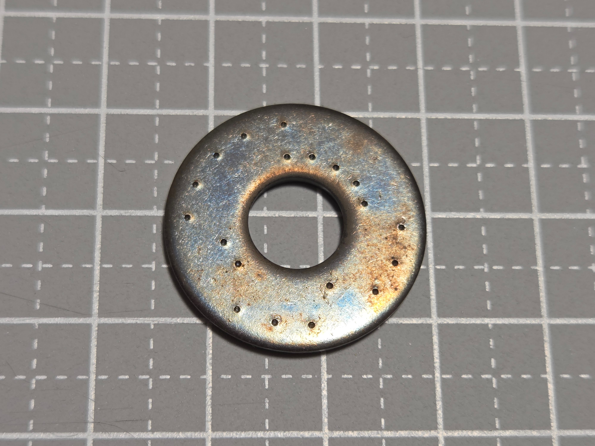
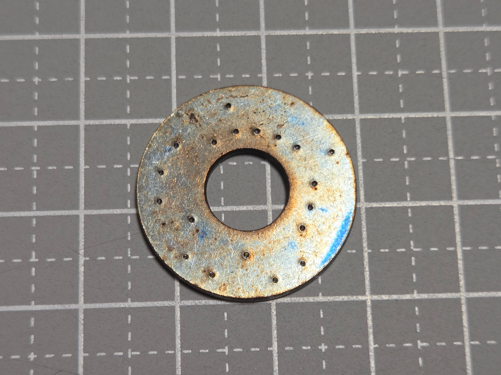
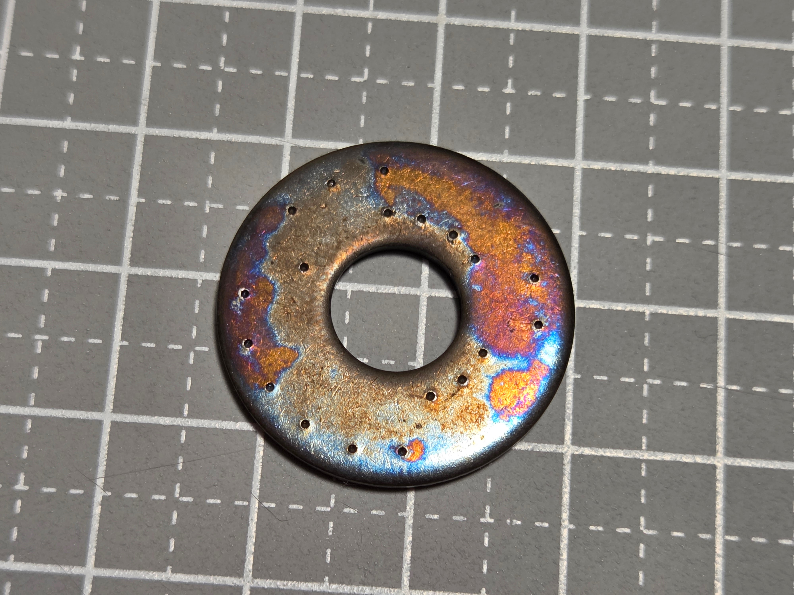
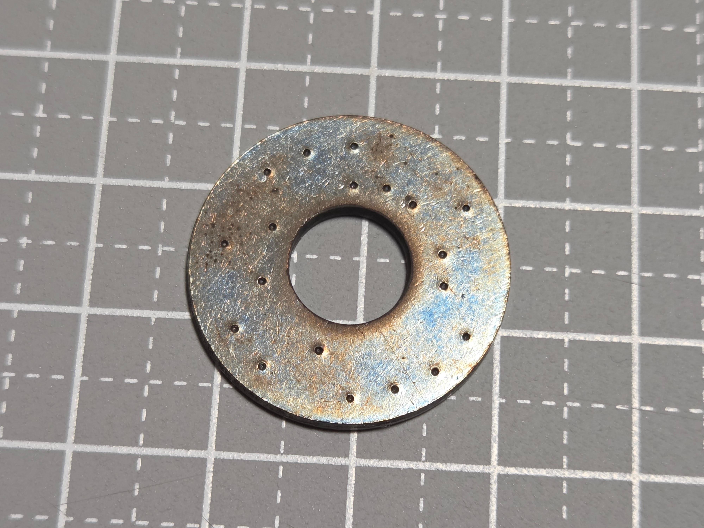

# Heat and quench test

[日本語](fire-test_ja.md)

This page records a **supplemental physical heat-and-quench test** performed on center-punched stainless-steel washers.

This was not a standardized fire-resistance test and does not establish a fire-resistance rating for Washer Punch39. The main question was whether the **small center-punch indentations remain visible instead of collapsing, disappearing, or becoming unreadable after strong heating and rapid cooling**.

## Test pieces

The punched patterns shown in these photos use an **earlier experimental 11-bit layout**, not the current four-point braille-style decimal encoding.

The test therefore does not directly validate the current encoding format. However, the current format also relies on small center-punch indentations, so the result is included as physical evidence about the survival of the punch marks themselves.

At the start of this test, the washer or washers being evaluated had not previously been heated. The **bolt, nut, and other washers used to hold the test pieces had already been heated in an earlier experiment and were reused**.

## Procedure

1. Heat with a gas flame for **20 minutes**.
2. Quench in water.
3. Heat again with a gas flame for **20 minutes**.

The assembly during gas-flame heating:

## Condition after the heat and quench cycles

The assembled hardware after the test:

The punched surfaces after the test are shown below.

  
  

  
  

## Observation

The surfaces show substantial heat discoloration, but the **individual center-punch indentations remain clearly visible in the photographs**.

Within the scope of this test, there is no obvious collapse that merges the punched positions together, and the punch marks do not appear to have disappeared to the point of becoming unreadable. The earlier 11-bit punch patterns remain visually traceable after the test.

In this experiment, the punch marks therefore remained visually distinguishable after the sequence of heating, water quenching, and reheating.

## How to interpret this result

This result does not establish a guaranteed temperature or duration rating for Washer Punch39.

The tested punch patterns also use the earlier 11-bit layout rather than the current four-point decimal encoding, so this is not a direct test of the current layout as a complete encoding system.

This page should be treated as **supplemental physical evidence that center-punch indentations survived one severe heating-and-quenching experiment**. Real fire exposure can differ in temperature, duration, cooling conditions, corrosion, and mechanical damage, and those conditions may produce different results.
