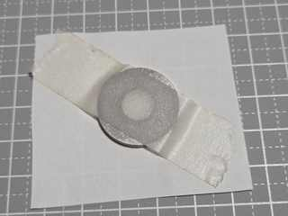
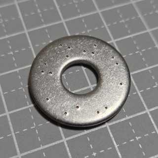
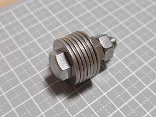

# 実物例

紙治具の印刷から、打刻したワッシャーをボルトでまとめるまでの実物例です。

## 1. 印刷した紙治具

実寸紙治具は **100% / 実際のサイズ / 拡大縮小なし** で印刷し、使用前に確認線で倍率を確認します。

## 2. ワッシャーへの位置合わせ

紙治具をワッシャーへ位置合わせして固定し、その上から必要な候補位置をセンターポンチで直接打刻します。

## 3. 打刻後のワッシャー

紙治具を外したあと、ワッシャー面の打刻位置を目視で確認します。

## 4. 組み上げ例

現在のリファレンス実装では、ワッシャーをボルトへ通し、ナットでまとめて保管できます。

寸法・符号化・復元方法については、[日本語README](../README_ja.md) と同ディレクトリ内の各資料を参照してください。
