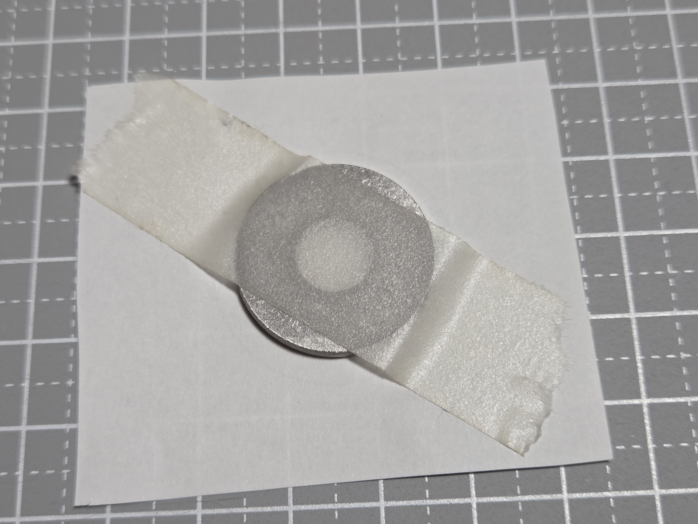
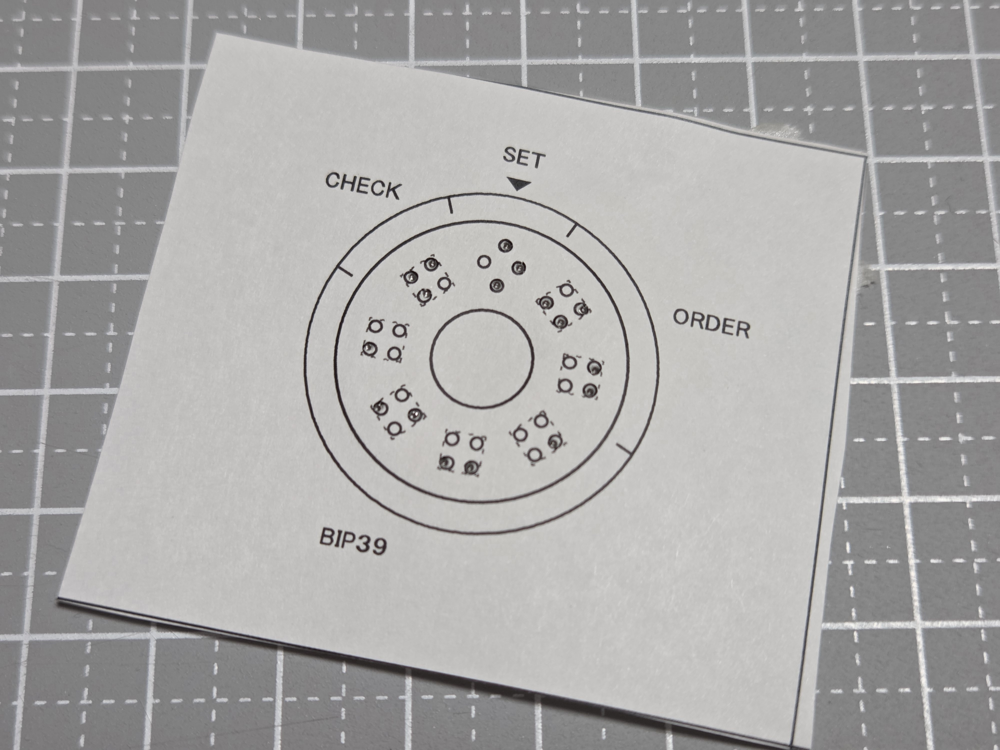

# 実物例

紙治具をワッシャーへ位置合わせ・固定し、打刻してからボルトでまとめるまでの実物例です。写真は作業工程の順に並べています。

## 1. ワッシャーへの位置合わせ・固定



実寸紙治具を **100% / 実際のサイズ / 拡大縮小なし** で印刷し、確認線で印刷倍率を確認します。紙治具とワッシャーを位置合わせしたあと、打刻中にずれないようワッシャーをマスキングテープで紙治具へ固定します。

## 2. 紙治具越しに打刻した後



必要な候補点を**自動センターポンチで紙の上から直接打刻した直後**の状態です。紙に見える穴や打痕は打刻によってできたものです。

## 3. 紙治具を外したワッシャー


紙治具を外したあと、ワッシャー面の打刻位置を目視で確認します。この写真の面を本方式で解読すると、次の内容です。

```text
A | 03 | 1391 (punch) | 6
```

数字部分はUnicode点字でも次のように表せます。ここでの点字文字は、ワッシャー上の4点式点字数字をテキストで示すための補助表記です。

```text
A | ⠚⠉ | ⠁⠉⠊⠁ | ⠋
    03     1391       6
```

- SET: **A**
- 語順: **03**
- BIP39番号: **1391 = punch**
- CHECK: **6**

CHECKは `1 + 3 + 9 + 1 + 6 = 20` となり、10の倍数なので正常です。

## 4. ボルト・ナットで組み上げた状態


現在のリファレンス実装では、ワッシャーをボルトへ通し、ナットでまとめて保管できます。

寸法・符号化・復元方法については、[日本語README](../README_ja.md) と同ディレクトリ内の各資料を参照してください。
