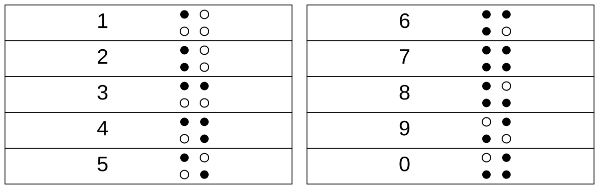

# 仕様

[English](specification.md)

この文書は、Washer Punch39（BIP39 Center-Punch Washer Backup）の現在のリファレンス形式を記録するものです。

## 対象範囲

この方式自体は応用可能な設計を意図しています。現在のリファレンス実装では、次の構成を使用しています。

- BIP39 English
- リファレンス例として12単語ニーモニック
- DIN 9021相当 M8ワッシャー
- SUS304 / A2ステンレス
- 外径 24.0 mm
- 内径 8.4 mm
- 厚さ 2.0 mm
- 現在の12単語リファレンス構成では7枚

これらは、このリポジトリで配布する実寸リファレンス資料と組み立て例を定義するための選択であり、方式そのものの必須条件ではありません。別のワッシャー寸法、語数、配置、工具、積み方を使用する場合は、必要に応じてそれに対応する幾何配置と復元規則を再設計し、独立に検証する必要があります。

## 12単語のリファレンス構成

現在のリファレンス構成では、12単語に7枚のワッシャーを使用します。

- 1枚目：片面だけ打刻、反対面は無刻印
- 2〜6枚目：両面を打刻
- 7枚目：片面だけ打刻、反対面は無刻印

これで打刻面は合計12面になります。

ボルトに通して保管するときは、1枚目と7枚目の無刻印面を外側へ向けます。組み上げた状態では、点字状の打刻が外から直接見えない構成になります。

この7枚構成は任意の物理実装であり、符号化方式の必須条件ではありません。製作者は別の積み方を採用できます。また、外側の無刻印面は視覚的に打刻を隠すためのものであり、暗号化やセキュリティ境界ではありません。

## 1面の構造

打刻された各面は、開始兼SETから時計回りに読みます。

```text
開始兼SET | 語順 十の位 | 語順 一の位 | BIP39 千の位 | 百の位 | 十の位 | 一の位 | CHECK
```

現在のリファレンス配置は、8つの論理ブロックで構成されています。

## 開始兼SETの幾何配置

現在のリファレンス配置では、開始兼SETは0°のブロックに置きます。

固定点：

- 外側固定点：半径 10.0 mm、角度 0°
- 内側固定点：半径 6.4 mm、角度 0°

SET候補点：

- 左：半径 8.4 mm、角度 -10° / 350°
- 右：半径 8.4 mm、角度 +10°

標準割り当て：

- A = 右SET候補点を打刻
- B = 左SET候補点を打刻
- 左右両方 = 標準では予約 / 無効
- 左右どちらもなし = 標準では予約 / 無効

## 点字数字セル

各10進数字は、ワッシャー上にコンパクトな正方形状として配置した4つの候補点で表します。

リファレンス候補点の半径：

- 内側候補点中心：7.2 mm
- 外側候補点中心：9.2 mm

数字0〜9の点の形は、標準点字数字の上4点を使用します。数字専用領域であるため数符は省略します。

**● = 打刻あり / ○ = 候補位置**。上段はワッシャーの外側、下段は内側です。



同じ点字数字はUnicode点字でも次のように表せます。

```text
0 1 2 3 4 5 6 7 8 9
⠚ ⠁ ⠃ ⠉ ⠙ ⠑ ⠋ ⠛ ⠓ ⠊
```

上のUnicode点字は、ワッシャー上の打刻パターンをテキストで表すための補助表記です。数符は同様に省略しています。

## 語順

現在の12単語リファレンス実装では、ニーモニック内の位置を10進2桁で記録します。

```text
01 〜 12
```

本プロジェクトの日本語資料では、この項目を一貫して `語順` と呼びます。

## BIP39番号

現在の標準仕様では、BIP39 Englishの単語表を1始まりで扱います。

```text
0001 = abandon
...
2048 = zoo
```

これは本プロジェクトで使用する人間向けの番号規則です。BIP39実装内部で使用される0始まりの11bit indexとは異なります。

## CHECK

CHECKは、BIP39番号4桁だけから計算する10進1桁です。

SETと語順は計算対象に含めません。

次の合計が10で割り切れるようにCHECKを決めます。

```text
BIP39 第1桁 + 第2桁 + 第3桁 + 第4桁 + CHECK
```

例：

```text
2048
2 + 0 + 4 + 8 = 14
CHECK = 6
14 + 6 = 20
```

CHECKは、10進1桁だけが別の数字へ置き換わる単一数字誤りを検出できます。ただし誤り訂正符号ではなく、複数の誤りの組み合わせをすべて検出できるわけではありません。

## 読み方向

ワッシャーの打刻面を読む場合は、

1. 読みたい面を自分に向ける
2. 開始兼SETを見つける
3. 時計回りに読む

という手順です。

裏面を、表面から続く鏡像として解釈しないでください。

7枚のリファレンス構成にある外側の無刻印面にはデータはなく、意図的に何も打刻しません。

## 紙治具

現在のリファレンス治具は、A4印刷用として次の構成になっています。

- 同一治具 12面
- 3列 × 4段
- 50 mm実寸確認線
- 100% / 実際のサイズ / 拡大縮小なしで印刷

治具にはすべての候補点を印刷し、シード固有の打刻選択は含めません。

## 打刻方法

現在のリファレンス手順では、紙治具の上からセンターポンチで直接打刻します。自動センターポンチは便利ですが、このデータ形式は自動機構を必須としません。

## 状態

この仕様はまだ実験段階です。安定版として扱う前に、実物試験、寸法確認、第三者による独立したレビューを行うことを想定しています。
